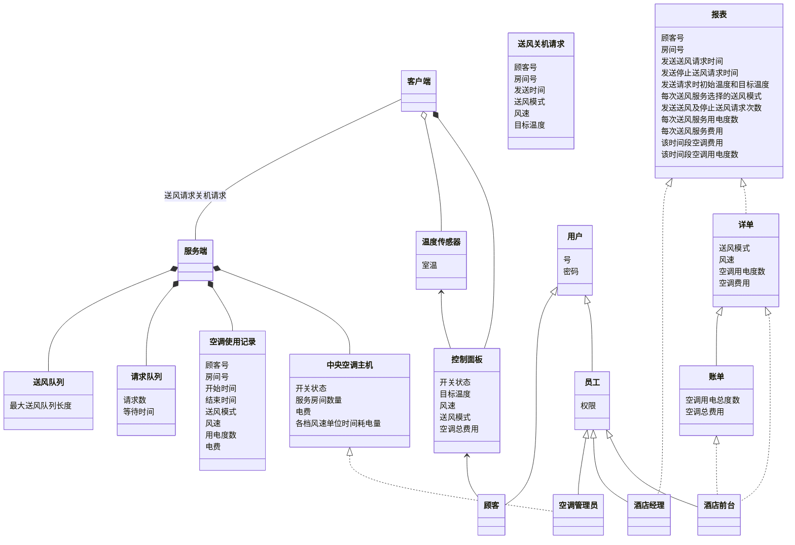
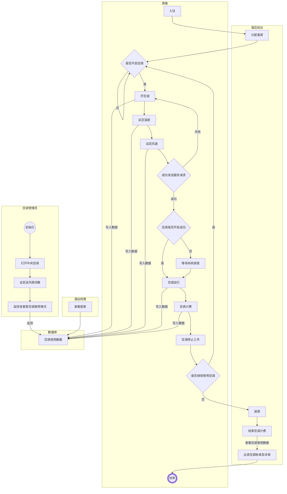

**分布式温控系统用户需求说明书**

> 20182111307 班 B 组
>
> 组长：汪多康	 
> 组员：程科 黄梓懿 黄哲 易洋宇 钟沛然
>
> 2021 年 03 月 15 日

[TOC]

> 迭代历史：
>
> - v0.1 | 2021/3/15 | 汪多康 | 创建文档，需求分析，确定技术路线
> - v0.2 | 2021/3/15 | 钟沛然 | 确定技术路线，初步需求分析
> - v0.3 | 2021/3/15 | 易洋宇 | 结合实际情况，确定性能要求
> - v0.4 | 2021/3/15 | 程科 | 根据实际情况，补充了一些非功能性需求
> - v0.5 | 2021/3/15 | 黄梓懿 | 对于非功能需求进行完善 
> - v0.6 | 2021/3/15 | 黄哲 | 调整功能性需求，完善非功能需求
> - v1.0 | 2021/3/16 | 汪多康 | 发布文档

## 0. 文档介绍 

### 0.1 文档目的

1. 以系统验收为目标，解读作业的目标与需求。
2. 给出分布式温控系统的技术路线设计。
3. 作为软件开发者的参考与指导，方便软件的开发、迭代以及更新。

### 0.2 文档概要

​	本文档是分布式温控系统的解决方案的顶层设计，主要内容包括对甲方需求的解读，系统各模块的设计及软件开发的技术路线设计。

## 1. 分布式温控系统产品介绍

### 1.1 产品的功能及作用

​	分布式温控系统是应用在快捷廉价酒店场景中的中央温控管理系统。通过本系统，入住酒店的顾客可以通过房间内的温控设备，根据要求进行温度和风速的调节，并得知因使用温控系统所需支付的金额。酒店前台可以通过本系统，在顾客退房时，打印用户使用温控系统的账单和详单。空调管理员可以在空调运行期间实时监控各房间的空调使用状态。酒店经理可以在需要的情况下，通过本系统查看不同时间范围内的格式化统计报表。

​	总体而言，通过本系统，酒店方可以得到集成度高、使用便捷的中央温控管理系统，数字化中央空调的管理，同时向顾客提供更加细致化的服务。

### 1.2 产品的开发背景

​	快捷廉价酒店以价格低廉，入住便利为优势，在酒店市场中占据一席之地。同时，快捷酒店需要在控制成本的同时，尽可能提供高质量服务以吸引顾客。许多快捷酒店采用中央空调系统以降低能耗，因此催生了分布式温控管理系统的需求。

​	分布式温控管理系统可以帮助酒店向用户提供更好地制冷/热服务，同时降低中央空调系统的能耗，帮助酒店提升服务质量和市场竞争力。

### 1.3 产品面向的客户群体

​	总体来说，系统面向的使用者有四类，包括酒店的顾客（使用客户端）和酒店工作人员（酒店前台、酒店经理、空调管理员，使用主控服务器端）。

## 2. 产品的功能性需求

### 2.1 主控服务器端

#### 计费管理功能

> 主控服务器端与计费和总体管理相关的功能。

| 功能名称 | 描述 |
|--|--|
| 账户管理功能 | 身份验证、权限设置、不同角色的用户登录。 |
| 数据采集 | 采集各房间中客户端设备的运行状态、运行时间、当前温度、设定温度、设定风速、当前消费金额等数据（用于统计信息的生成）。 |
| 数据存储 | 将客户端传来的信息存储在数据库中。 |
| 计费设置 | 设置客户端的费用计算方式，用于计算费用。 |
| 退房结算 | 处理采集得到的数据，在用户退房离开时，计算最终用户的费用，生成账单和空调使用详单。 |
| 实时监控 | 实现对各装有客户端的房间的空调使用情况实时监控。 |
| 报表生成 | 实现对不同时间范围内的使用状态的格式化统计，并生成统计报表。 |
| 查看收益情况 | 查看总温控系统的收益、能耗详细情况。 |

#### 空调控制功能

> 主控服务器端管理各房间空调的相关功能。

| 功能名称 | 描述 |
|--|--|
| 空调启动/关闭 | 控制温控系统总开关。                                         |
| 查看运行情况  | 查看空调的运行情况、各个房间的空调状态。                     |
| 数据采集      | 采集各房间中客户端设备的运行状态、运行时间、当前温度、设定温度、设定风速、当前消费金额等数据（用于空调运行控制）。 |
| 中央空调控制  | 控制中央空调的运行情况。                                     |
| 房间温控 | 根据各个房间用户的不同需求以及中央空调的运行情况，采用一定的调度算法，控制各个房间空调的运行情况。 |
| 异常报警 | 对客户端产生的异常状态（如退房后未关闭空调、非正常中断连接）进行报警。 |

### 2.2 客户端

#### 空调控制功能

> 实现房间空调控制的相关功能。

| 功能名称 | 描述 |
|--|--|
| 打开/关闭空调 | 空调的启动与关闭。 |
| 状态显示 | 在用户使用过程中，持续显示空调运行状态。 |
| 风速调节 | 用户手动设置三挡风速（低速->中速->高速） |
| 温度调节 | 用户手动的温度调节，范围为 18-30°C。 |
| 主控通信与空调控制 | 向主控服务器发送运行请求。根据主控服务器返回的调度信息设定房间空调运行状态。达到目标温度后使空调暂停工作。当房间温度距离目标温度差距大于 1°C 时，自动重新启动。 |
| 费用显示 | 在用户使用过程中，持续显示费用，实时刷新。 |

## 3. 产品的非功能性需求

### 3.1 主控服务器端

| 需求类型|描述|
|:--|---|
| 用户友好性 | 服务器界面简洁优雅，实用性强，各个按钮在界面中合理分布，符合人视觉，有明显的异常告警提示，方便管理员管理、监控。服务器端应该能够直白地显示各个客户端的状态，各机器的能耗统计数据及费用报表。 |
| 安全性 | 服务器应提供管理员身份认证、授权控制、以及系统安全性等方面的保证。同时监控分布式温控系统内部的流量情况，发现异常流量情况时及时警报。对系统外部及内部的潜在攻击有一定的防御能力，防止出现系统被恶意破解出现流量监测失灵。 |
| 健壮性 | 服务器应具有应对可能的并发大规模请求的能力，保证系统不会在大量住户的同时请求下崩溃，同时保证服务器能够在同一时间对所有用户进行访问控制以处理紧急情况。 |
| 易用性 | 服务器的使用应尽可能地保持简单，并且对服务器的使用应该提供尽可能详细的使用说明，保证酒店人员能够尽可能简单、快捷地使用服务器。 |
| 可靠性 | 系统需要 7 X 24 小时连续运行，数据定期备份，年计划宕机时间不能高于 10 小时，并且要求能快速反馈情况，特别是在系统出现故障时，能够快速告知管理人员，能够数据恢复，易于系统异常处理，并能够提供应急服务，保证酒店温控系统的正常工作。 |
| 可维护性 | 服务器系统应保证良好的可维护性。服务器应保证定时或在事件驱动下输出日志，保证维护人员可以复盘系统状态，在故障发生时及时的监测、诊断以及修复温控系统。 |
| 可配置性 | 服务器的参数应该是可配置的，以使其可以通过不同的配置文件灵活部署于不同的平台及系统。 |
| 可移植性 | 系统应能够在不同平台及操作系统下使用，具有良好的兼容性。在少量修改或者不作修改的基础上就可以方便、快捷地部署在不同的硬件及软件平台上。 |
| 可重用性 | 分布式温控系统应该具备良好的可重用性，即在可配置性和可移植性的基础上，能够在不同的酒店及平台上应用，针对不同的情况仅需做出适应不同条件的简单修改，避免程序重复开发。 |
| 可扩展性 | 分布式温控系统应具有对技术和业务需求变化的支持能力。当技术变化或业务变化时，不可避免将带来系统的改变。所以系统不仅可能面临进行设计实现的修改，甚至面临着进行产品定义的修改。因此，系统的设计应在系统架构上考虑能以尽量少的代价适应这种变化。|

### 3.2 客户端

| 需求类型|描述|
|:-:|:-:|
| 用户友好性 | 要求客户端界面简洁美观，具有很强的实用性，各按钮合理配置区域，有明显的异常告警提示，方便用户使用。各基本功能应该清楚地显示在界面中，包括开关、温度及风速调节、模式、控制方式等，不会因界面显示问题使用户出现模糊理解导致出现操作不便、意外消费等情况。 |
| 安全性 | 客户端应提供住客及客房打扫人员等的身份认证及控制授权，保证客户端不会被非法控制。并且客户端应该具有一定的连接到服务器端的接入限制，防止出现从客户端恶意黑入服务器进行非法操作的情况。 |
| 健壮性 | 客户端在面对住客非正常使用时(如在短时间内多次按下模式切换键)能够正常地响应用户，保证系统不会崩溃，并且尽最大限度的保证客户误触的情况下系统能够有一定的处理能力。 |
| 易用性 | 客户端的界面应该清晰，并对新用户有充足而简洁明了的引导及帮助，保证用户能够正确地使用从控机以发出温控请求。 |
| 可靠性 | 客户端应能保证较低的故障率，并且在故障发生时能够及时地告知服务器端及工作人员进行故障修复，并且在客户端有明确显示，以告知客户出现客户端故障无法正常使用。 |
| 可维护性 | 客户端应该能够记录每一条发出的请求及来自服务器的控制命令，允许在管理员的操控下输出运行日志，记录系统运行状态。当发生故障时，保证维护人员可以监控和观察客户端和服务器状态，在故障发生时准确定位故障原因进行修复。 |
| 可配置性 | 客户端的参数应该是可配置的，以使得客户端通过不同的配置文件适应不同客户的需求。客户端系统可以记录不同用户的使用习惯，使得用户再次入住时不需要重复设置，但要设置定期清理以防成本过高。 |
| 可移植性 | 客户端软件应该能够方便快捷地部署在不同的平台上。如手机、壁挂面板等，以使得用户可以更方便地操控客户端。 |
| 可重用性 | 客户端在可配置性和可移植性的基础上，能够在不同的酒店及平台上应用，避免重复开发。|
| 可扩展性 | 在面对技术及需求不断的更新时，客户端应该能够方便快捷地进行升级扩展。这要求客户端与服务器架构上解耦，从软硬件两方面能够以尽可能小的成本升级修改。|

## 4. 技术路线 

### 4.1 软件生命周期模型
​	软件生命周期模型描述了软件整个生存期开发、运行和维护所实施的全部过程、活动和任务，同时描述生命周期不同阶段产生的软件工件，明确活动的执行角色等。
此系统开发采用新型软件周期模型RUP（Rational Unified Process），RUP 中的软件生命周期在时间上被分解为四个顺序的阶段：初始阶段（Inception）、细化阶段（Elaboration）、构造阶段（Construction）和交付阶段（Transition）。每个阶段结尾以主要里程碑（Major Milestones）来界定，并评估以确定阶段目标是否已经满足。

​	RUP的每个阶段可以进一步划分为一个活多个迭代过程，迭代过程使中间版本的开发实现循环，从一个迭代过程到另一个迭代过程增量行程最终的系统。RUP融合了喷泉模型和增量模型，构成了综合性的生命周期模型。

​	RUP模型因为迭代式的特点，可以满足在短时间内上线产品，并在此基础上不断更新、扩展功能。且对于开发人员来说，同时，因为基于组件的体系 结构，能够更加适应变化、易于理解。对于使用人员来说，由 UML 形成的可视 化的模型可以让酒店的管理人员更容易理解和管理软件。在本系统的开发过程中，以RUP为生命周期模型进行开发，有助于系统的完成。

### 4.2 系统开发技术栈

​	系统暂定采用Client-Server架构，以PC软件的形式作为服务器端的界面，并采用PC软件模拟运行在分布式温控设备（各房间的空调遥控装置）上的客户端。

​	客户端的开发使用C++语言，采用QT实现可视化。

​	服务器端开发采用Python语言，使用QT实现可视化，采用MySQL作为数据库存储。

## 5. 领域模型

### 5.1 用户需求定义
| ps: 红色加粗为实体类，斜体为属性                             |
| ------------------------------------------------------------ |
| **用户**分为**员工**，**顾客**。**员工**又可细分为**空调管理员**，**酒店前台**，**酒店经理**，每个员工有不同的*权限*。每个用户都有自己的*号*，*密码*用于登录。 |
| **空调管理员**可设置**中央空调主机**的*开关状态*和服务房间数量 ，以及电费 （默认1元/度）与*各档风速单位时间耗电量* （默认高风0.01666度/秒，中风0.00833度/秒，低风0.00556度/秒）。 |
| **空调管理员**能够监控各房间空调的使用状态，即查看**请求队列**和**送风队列**信息 |
| **顾客**入住酒店，**酒店前台**分配给每一个**顾客**一个*顾客号*，一个*房间号*，*密码*即为房间号，对应房间的**控制面板**开始计费并显示*费用* |
| **顾客**退房，**控制面板**停止计费,**酒店前台**开具空调使用的**账单**及**详单**。**账单**包含*空调用电总度数* 以及*空调总费用* ，**详单**包含房间空调各时间段的*送风模式* 、*风速*、*空调用电度数*、*空调费用*。 |
| **顾客**可以通过**控制面板**设定当前房间空调的*开关状态*、*目标温度*、*风速* ，查看空调的*送风模式*、**温度传感器**传来的*室温*  以及*空调总费用*  。*送风模式* 为制冷模式时，*目标温度* 为18-25℃；为制热模式时，*目标温度* 为25-30℃。*开关状态*、*目标温度* 、*风速*连续两次或者多次指令发送的时间间隔小于1秒时，只发送最后1次的指令参数；大于1秒的情况下，将发送两次请求。*风速* 可设高风、中风、低风三档 |
| **客户端**根据**顾客**设定向**服务端**发出**送风请求**，内容包括*顾客号* 、*房间号*、*发送时间*、*送风模式*、*风速* 、*目标温度*。*室温* 达到*目标温度*（即制冷模式下*室温* ≤*目标温度* ，制热模式下*室温* ≥*目标温度* ），发送*风速* 为无风的**送风请求**给**服务端**；当*室温* 超过或低于*目标温度* 1℃时（即制冷模式下*室温*  ≥*目标温度* +1，制热模式下*室温*  ≤*目标温度* -1），根据目前的*风速* 、*目标温度*、*送风模式*设定，发送指定**送风请求**给**服务端**，**顾客**关机时，**客户端**发送**关机请求**，**关机请求**内容和**送风请求**一致，只是*送风模式*为关机 |
| **服务端**接收来自**客户端**的**送风请求**/**关机请求**，删除在**请求队列** 或**送风队列** 里老的（*房间号* 相同、*发送时间* 更早的）**送风请求**，若*风速* 不为无风或关机，添加该**送风请求**至**请求队列**，并新建**空调使用记录**，其内容包括*顾客号* 、*房间号*、*开始时间*、*结束时间*、*送风模式*、*风速* 、*用电度数* 、*电费* 。收到新的**送风请求**或**关机请求**，**空调使用记录**结束记录,并更新*结束时间*，计算出*电费*。以时间单位（默认为s）作为更新周期，维护**请求队列** 和**送风队列** ，使得*送风队列长度* <= *最大送风队列长度* 。调度的原则为：如果当前**请求队列**中有*风速*大于当前**送风队列**所有服务状态中最小*风速*，则将*风速*更大的请求移动到**送风队列**。每隔一定时间间隔，如果某一送风请求在**送风队列**中有相同*风速*的服务，则替换之(如果请求队列有多个满足时间片轮转条件的请求，则以等待时间更长的请求优先)。替换到**请求队列**的**送风请求**更新自己的*发送时间*为当前时间 |
| **温度传感器**记录*室温*变化，中风模式下每分钟变化0.5度，高风模式每分钟变化率提高20%，低风模式每分钟变化率减小20%；房间温度达到目标值以后，客户端自动发送停止送风请求给服务端。此后，当房间温度超过目标温度1度时，重新启动。关机状态下，每分钟变化0.5度，直到变化到初始温度为止； |
| **酒店经理**可查看某时间范围内的格式化统计**报表**（默认为1日）。**报表**内容为*顾客号、房间号、发送送风请求时间、发送停止送风请求时间、发送请求时初始温度和目标温度、每次送风服务选择的送风模式、发送送风及停止送风请求次数、每次送风服务用电度数、每次送风服务费用、该时间段空调费用、该时间段空调用电度数* |

### 5.2 类图 

### 5.3流程图

